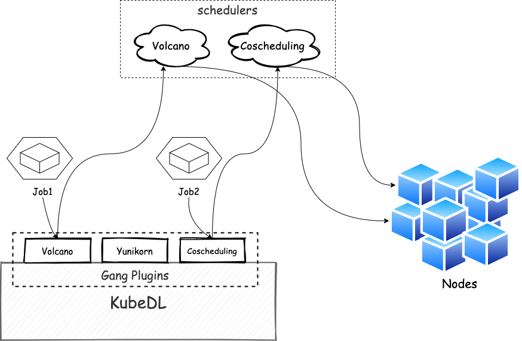

Gang Scheduling is a critical feature for Deep Learning workloads to enable all-or-nothing scheduling capability, as
most DL frameworks requires all workers to be running to start training process. Gang Scheduling avoids resource
inefficiency and scheduling deadlock sometimes.

KubeDL supports gang scheduling with different schedulers as a backend. Today, several Kubernetes schedulers support
gang scheduling, including the [Coscheduling Scheduling Plugin](https://github.com/kubernetes-sigs/scheduler-plugins/blob/master/pkg/coscheduling/README.md),
[YuniKorn](https://yunikorn.apache.org/), Volcano, KubeBatch. Each has its own advantages and its own API protocols.

KubeDL provides a plugin framework to support different schedulers as a backend. Currently, KubeDL supports kube-coscheduler(popular on alibaba cloud), volcano(a batch system under CNCF) and kube-batch.

<figure>

<figcaption align = "center"><b>kubedl gang schedule</b></figcaption>
</figure>

### How to Enable

Enable gang scheduling using the KubeDL controller startup flag `--gang-scheduler-name`.
For example: `--gang-scheduler-name=kube-coscheduler`

By default, it is empty meaning not enabled. Supported values are `kube-coscheduler`, `volcano` and `kube-batch`.

### Reference

- How to setup kube-coscheduler plugins. [Go ->](https://github.com/kubernetes-sigs/scheduler-plugins)
- How to setup kube-batch scheduler. [Go ->](https://github.com/kubernetes-sigs/kube-batch)
- How to setup volcano scheduler. [Go ->](https://github.com/volcano-sh/volcano)
Author: jian-he, 4 months ago
