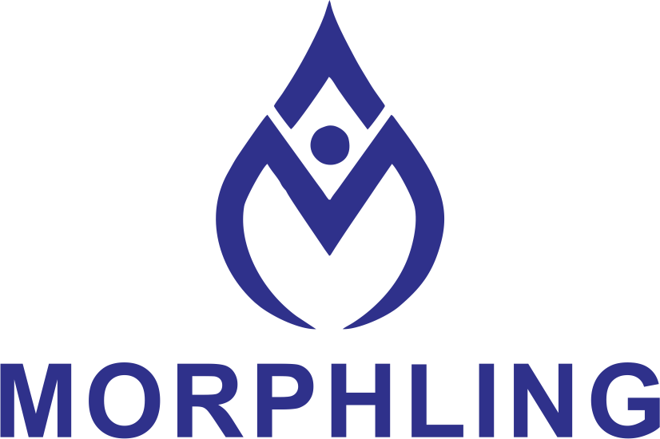
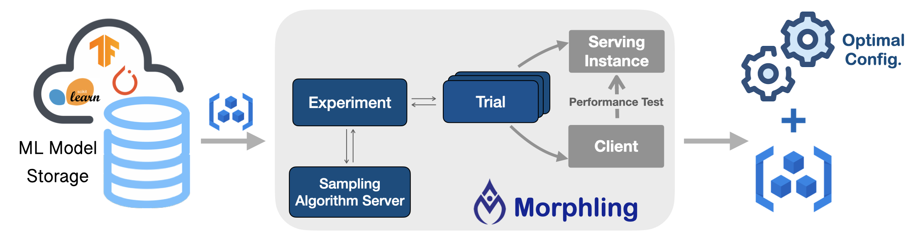

KubeDL automatically tunes the best container-level configurations
before an ML model is deployed as inference services.
This auto-configuration workflow is developed as an independent project---**Morphling**.   [Github  →](https://github.com/alibaba/morphling)

<figure>
<h1 align="center">

</h1>
</figure>

## Morphling Overview

Morphling tunes the optimal configurations for your ML/DL model serving deployments.
It searches the best container-level configurations (e.g., resource allocations and runtime parameters) by empirical trials, where a few configurations are sampled for performance evaluation.

<figure>

<figcaption align = "center"><b>Morphling Workflow.</b></figcaption>
</figure>

## Features

Key benefits include:

- Automated tuning workflows hidden behind simple APIs.
- Out of the box ML model serving stress-test clients.
- Cloud agnostic and tested on [AWS](https://aws.amazon.com/), [Alicloud](https://us.alibabacloud.com/), etc.
- ML framework agnostic and generally support popular frameworks, including [TensorFlow](https://github.com/tensorflow/tensorflow), [PyTorch](https://github.com/pytorch/pytorch), etc.
- Equipped with various and customizable hyper-parameter tuning algorithms.

## Core APIs

Morphling requires users to specify the `ProflingExperiment` interface for configuration tuning,
including:

- ML model container (e.g., the Pod template)

- performance objective function

- tunable configuration parameters with types and search range

- sampling algorithms

- sampling budget

## Getting started

### Install using YAML files

Install Morphling using YAML files. [Go →]()

### Examples

Run model serving configuration examples. [Go →]()

## Workflow

See [Morphling Workflow]() to check how Morphling tunes ML serving
configurations automatically in a Kubernetes-native way.

## Developer Guide

To develop/debug Morphling controller manager locally, please check the [Developer Guide]() and [Debug Guide]().

## Community

If you have any questions or want to contribute, GitHub issues or pull requests are warmly welcome.
