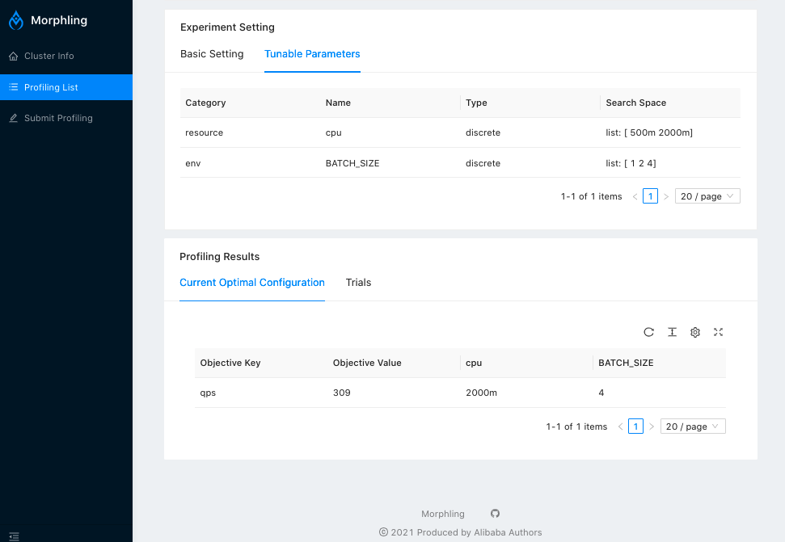

## Deploy Morphling UI
Morphling UI is built upon [Ant Design](https://ant.design/).
If you are installing Morphling with Yaml files, from the root directory, run


```bash
kubectl apply -f manifests/ui
```

Or, if you are installing Morphling with Helm chart, Morphling UI is automatically deployed.

<figure>

<figcaption align = "center"><b>Morphling UI.</b></figcaption>
</figure>

Check if all Morphling UI is running successfully:


```bash
kubectl -n morphling-system get svc morphling-ui
```

Expected output:

```bash
NAME           TYPE       CLUSTER-IP     EXTERNAL-IP   PORT(S)        AGE
morphling-ui   NodePort   10.96.63.162   <none>        9091:30680/TCP   44m
```

If you are using minikube, you can get access to the UI with port-forward:

```bash
kubectl -n morphling-system port-forward --address 0.0.0.0 svc/morphling-ui 30263:9091
```

Then you can get access to the ui at http://localhost:30263/.

For detailed UI deployment and developing guide, please check [UI.md](https://github.com/alibaba/morphling/blob/main/console/README.md)

## Developer Guide

### Prerequisites

- NodeJS > 10
- Go > 1.14

### Folder structure

1. For React frontend, you can find it under [console/frontend](./frontend).

2. For Go backend you, can find it under [console/backend](./backend).

### Development

#### Build Console Backend Server


```bash
go build -mod=vendor -o backend-server morphling/console/backend
```

#### Run local Console Backend Server

1. Prepare a `kubeconfig` file which defines k8s development environment.
2. Set `KUBECONFIG` environment variable.


```bash
export KUBECONFIG={/path-to-kubeconfig-file}
```

### Serve UI frontend


```bash
cd console/frontend/
```

1. Install dependencies (optional)


```bash
npm install
```

2. Run `npm run build` under `/frontend` folder. It will create `/frontend/dist` directory with optimized production build.

3. Go to `console/backend/`.

4. Run backend server with disabled authentication mode


```bash
./backend-server
```

After that, you can access the UI using this URL: `http://localhost:9091`.

#### Optional: Start Console Frontend with Connection to other dev Backend-Server directly

If you are not able to run local console backend server, or other dev console backend server is already present, you could make frontend dev server to proxy API requests to other dev backend server directly.

1. Change Proxy Backend
   Path: console/frontend/config/config.js

```javascript
  proxy: [
    {
      target: "http://localhost:9091",
      ...
    }
  ]
```

change the target to address <ip:port> of other present console backend server.

2. Run Console Frontend Dev Server


```bash
npm run start
```

## Code style

Our UI is built upon [Ant Design](https://ant.design/).
